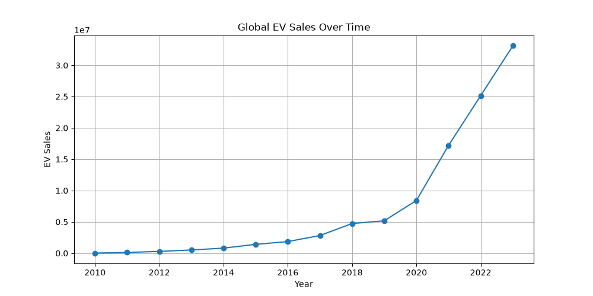
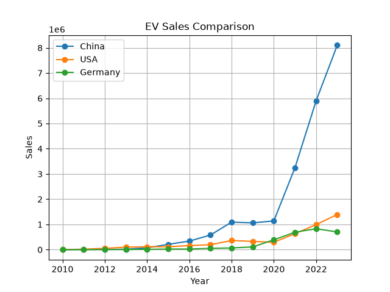
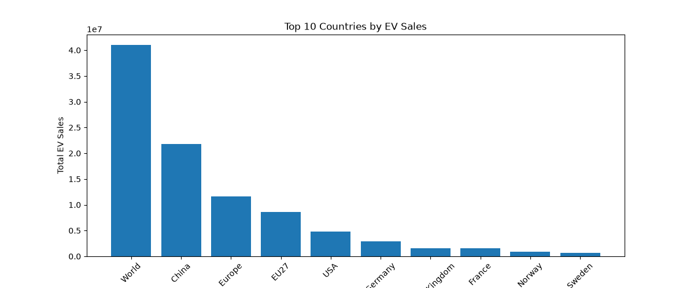
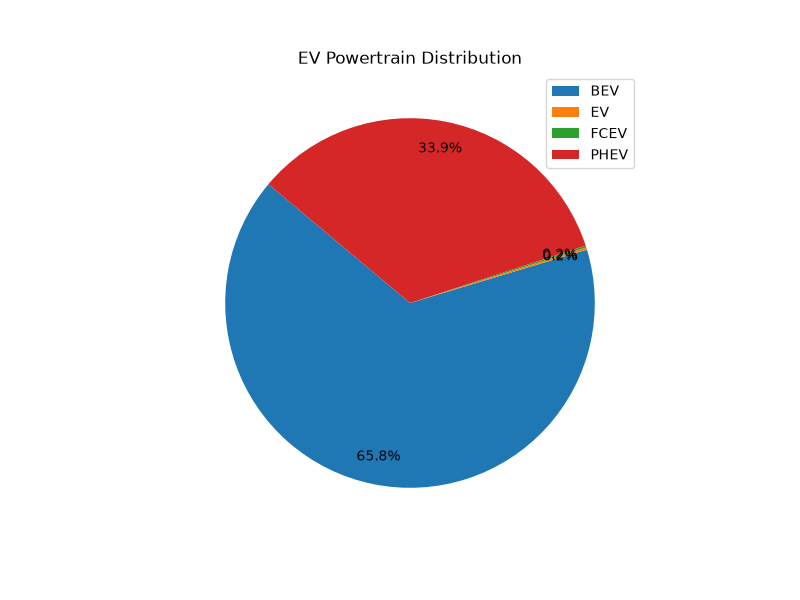
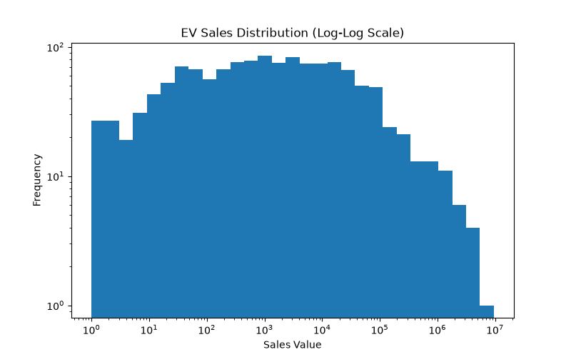
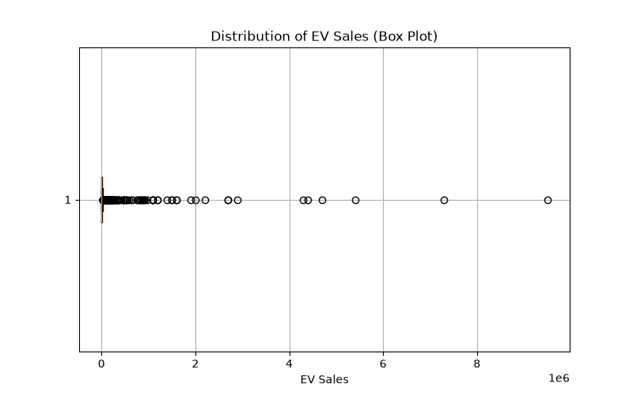
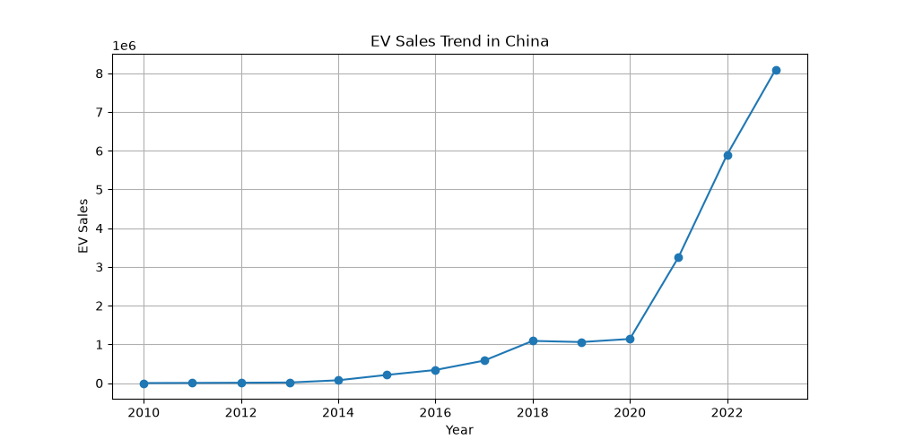

# Electric Vehicle Sales Analysis


## Overview

This project explores historical Electric Vehicle (EV) sales data using **Python**, **Pandas**, **NumPy**, and **Matplotlib**. The analysis investigates global EV adoption trends, compares leading markets, examines different powertrain technologies, and applies statistical techniques to uncover meaningful insights from the data.

The project was completed as part of my data analysis learning journey to strengthen my skills in data manipulation, exploratory data analysis (EDA), statistical analysis, and data visualization using Python.

---

## Project Objectives

* Explore and understand a real-world EV sales dataset.
* Clean and prepare the dataset for analysis.
* Perform Exploratory Data Analysis (EDA).
* Analyze EV sales trends across countries and years.
* Compare different EV powertrain types.
* Apply NumPy for statistical analysis.
* Visualize findings using Matplotlib.
* Generate meaningful insights from the data.

---

## Dataset

* **Source:** International Energy Agency (IEA)
* **Dataset:** Historical Electric Vehicle Sales Data
* **Time Period:** 2010–2023
* **Vehicle Category:** Cars
* **Regions Covered:** 52 countries/regions
* **Records:** Approximately 3,800

---

## Tech Stack

| Technology | Purpose |
|------------|---------|
| Python | Programming language |
| Pandas | Data manipulation and analysis |
| NumPy | Numerical and statistical analysis |
| Matplotlib | Data visualization |
| Jupyter Notebook | Interactive development environment |

---

## Project Structure

```
EV-Sales-Analysis/
│
├── data/
│   └── IEA-EV-dataEV salesHistoricalCars.csv
│
├── notebooks/
│   └── EV_Sales_Analysis.ipynb
│
├── images/
│
├── README.md
├── requirements.txt
└── .gitignore
```

---

## Analysis Workflow

1. Data Inspection
2. Data Cleaning
3. Exploratory Data Analysis (EDA)
4. Statistical Analysis using NumPy
5. Data Visualization
6. Insight Generation

---

## Key Findings

* Global EV sales increased dramatically over the study period, with especially rapid growth after 2020.
* China emerged as the leading EV market, significantly outperforming other countries.
* Battery Electric Vehicles (BEVs) accounted for the largest share of EV adoption.
* EV adoption remains uneven across regions, with a small number of countries contributing most global sales.
* Statistical analysis revealed a highly right-skewed distribution, indicating the presence of several high-sales outliers.

---

## Visualizations

The following visualizations were created to explore trends and patterns in the EV sales dataset.

---

### Global EV Sales Trend



---

### EV Sales Trend (Overall)



---

### Top 10 Countries by EV Sales



---

### EV Powertrain Distribution



---

### EV Sales Distribution (Histogram)



---

### EV Sales Box Plot



---

### EV Sales Trend in China



---

## Skills Demonstrated

* Data cleaning and preparation
* Data manipulation with Pandas
* Exploratory Data Analysis (EDA)
* Statistical analysis with NumPy
* Data visualization using Matplotlib

---

## Future Improvements

* Develop an interactive dashboard using Plotly or Power BI.
* Build predictive models to forecast future EV sales trends.
* Integrate additional datasets such as charging infrastructure and battery prices.
* Extend analysis to include other vehicle categories (trucks, buses, etc.).

---

## Author

**Sami Mirza**

Electrical Engineering student with a strong interest in Artificial Intelligence, Machine Learning, Data Science, and Python. This project is part of my portfolio showcasing practical data analysis skills using real-world datasets.
